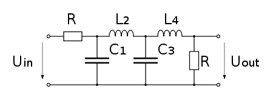
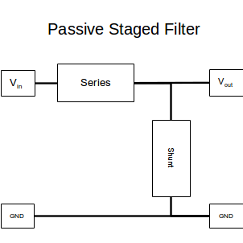
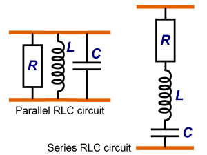

# Analog Notes

## Passive Staged Analog Filters
Analog filters are created using staged componets sometimes refered to as ladders.

Each rung of the ladder contains a Series and a Shunt impedence that are staged one after the other.

The series componets have to be in series while the shunt componetshave to be in parallel.

It is simple to figure out the cutoff frequency of each of the stages.
Therefore by combining multiple stages the, overall gain of each stage gets multiplied together. This allows for an easy way to build multiple poled passive filters and figure out the frequency response. I've written some python code where you can simply input the real values of the components and recieve the frequency response of the stage. It is also possible to stage multiple poles and recieve the overall frequency response.

[passive_filter.ipynb](./passive_filter.ipynb)
