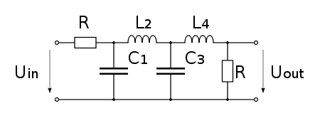
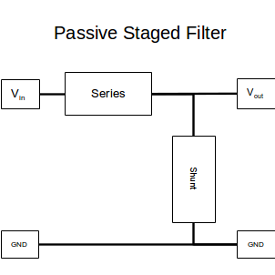
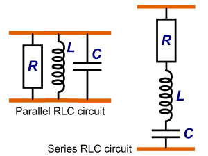

# Analog Notes

## Passive Staged Analog Filters
Analog filters are created using staged componets sometimes refered to as ladders.

Each rung of the ladder contains a Series and a Shunt impedence that are staged one after the other.

The series componets have to be in series while the shunt componetshave to be in parallel.

It is simple to figure out the cutoff frequency of each of the stages.
Therefore by combining multiple stages the, overall gain of each stage gets multiplied together. This allows for an easy way to build multiple poled passive filters and figure out the frequency response. I've written some python code where you can simply input the real values of the components and recieve the frequency response of the stage. It is also possible to stage multiple poles and recieve the overall frequency response:

[Passive Filter](./PassiveFilter/passive_filter.ipynb)

## High Quality Signal Generator
To test the signal acquisition pipeline we must generate signals that we can input to check for distortions. The signals we generate must include amplitudes of -70mV to 100mV and frequencies of 1Hz to 40Hz.[1]
To create these very small voltages we will be producing larger voltages and then using resistors to step the voltage down to the desired range. To test frequency performance of our pipeline, we'll need to generate clean single tone frequencies. This is harder to do as simply low pass filtering a PWM squarewave leaves unwanted harmonics in the pipeline. Therefore we'll be using an arduino with better filtering to generate high quality signals. We will be following this guide:

[ARduino DDS Sinewave Generator](http://interface.khm.de/index.php/lab/interfaces-advanced/arduino-dds-sinewave-generator/)

The Arduino code and modifications can be found in  [Arduino_Signal_Generator](./SignalGenerator/Arduino_Signal_Generator)

## References
[1] [Electroencephalography](http://www.bem.fi/book/13/13.htm)
