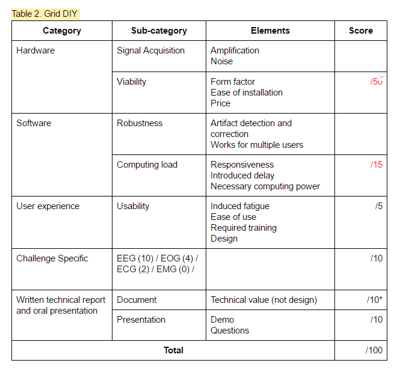

# Biosignals-Board

## Overview

The goal of this porject is to create a biosignals-board capable of picking up EEG from an individual. It will pick up the analog signal, amplify it, and convert it to a digital signal to be transfered to a computer. This signal can then be used to control external applications. The biosignals-board will be created to compete in the NeurotechX competition.

### NeurotechX Competition Specifications

1. [Competition Website] (http://neurotechx.com/studentclubs.html#about "NeurotechX Competition")
2. [Rules Breakdown] (http://neurotechuoft.github.io/Files/NeuroTechX-StudentClubCompetition-Validation.pdf "Rules")  

## Project Plan

We will be using the ~~ADS1299~~ NeuroSky brainwave [EEG: TGAM] chip to collect, amplify and digitally encode the signal. Using its onboard UART features, we will transmit the signal over bluetooth to a laptop.

[EEG: TGAM]: ./TGAM/
