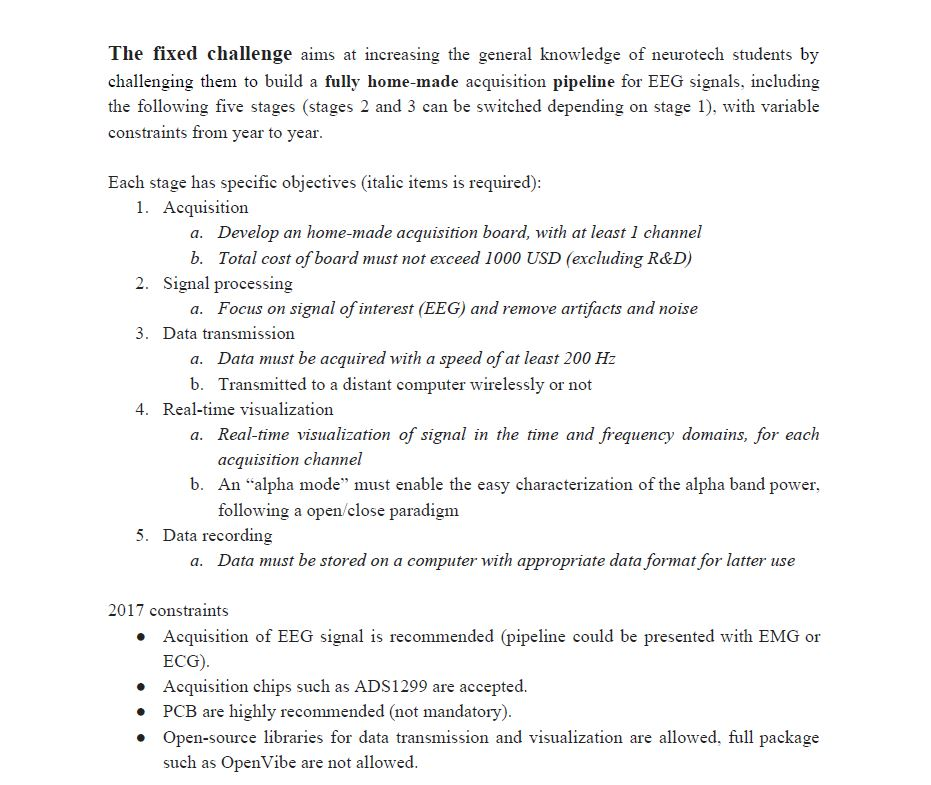
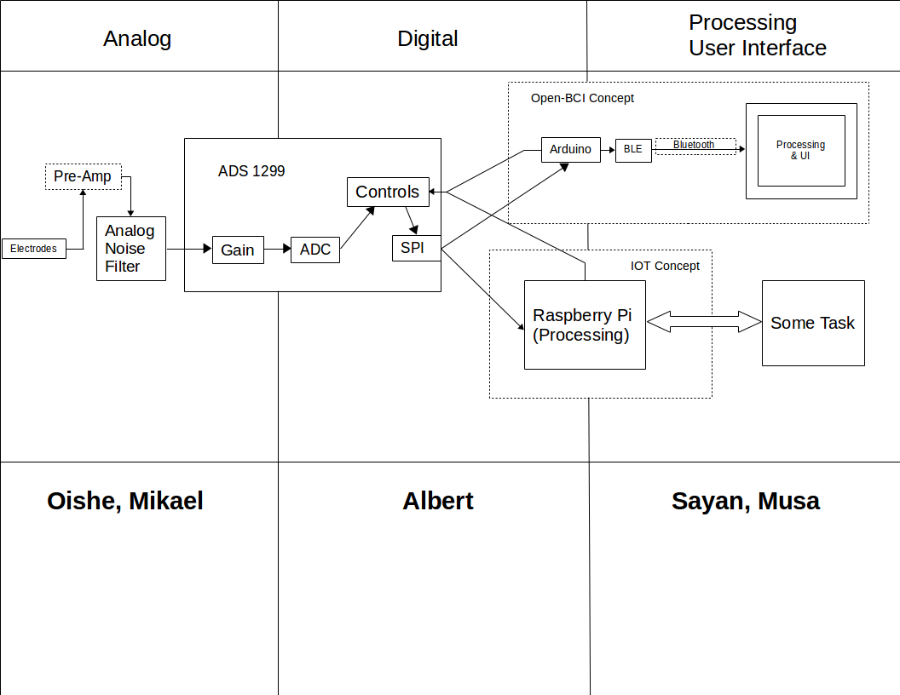

# Biosignals-Board

## Overview

The goal of this project is to build an EEG (electroencephalogram) signal acquisition pipeline for the "Fixed Challenge" portion of the NeurotechX Student competition taking place at the end of November 2017. The pipeline will consist of a biosignals board that is capable of picking up an analog EEG signal, perform analog to digital conversion and signal processing, and transmit the signal to a distant computer for real-time visualization and other applications.

### NeurotechX Competition Specifications

1. [Competition Website] (https://neurotechx.github.io/studentclubs/competition/ "NeurotechX Competition")

## Project Plan
We are planning to work on the project during the summer of 2017 with a targeted completion date of August 31, 2017, leaving two months for testing and polishing the final product. The project is being organized into three subsections: analog signal acquistion and amplification, analog to digital conversion, and data transmission/software, which will all be developed concurrently. For analog to digital conversion, we will be using the Texas Instruments [ADS1299 ADC chip](./ADS1299/) to convert the acquired EEG signal.

## Project Progress
* Developed high-level schematic of entire system

## Future Tasks
* Follow [MeetingNotes](./2017/MeetingNotes) for updates

## Excelent Resources
* [EEG PocketGuide](./2017/Resources/iMotions_Guide_EEG_Pocket_2016.pdf)
